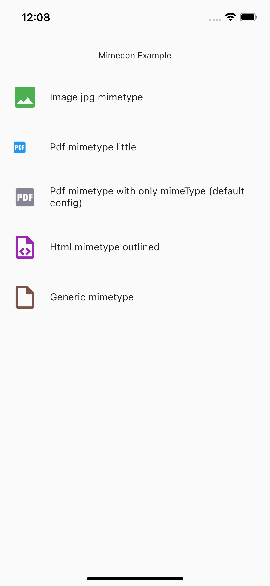

# Mimecon
A package to bind an icon to a mimeType

## Pull requests
Pull requests are welcome, I'm a beginner so don't hesitate if you see any corrections

## Usage

- Insert a mimetype label (eg: "image/png", "application/pdf"...)
- Defined some parameters a size, color, isOutlined etc if you want 
- An icon who match with the mimetype label will be return 


## Example

```dart
 Mimecon(
    mimetype: "application/png",
    color: Colors.red,
    size: 25,
    isOutlined: true,
  ),
```



## Additional information

https://github.com/romgrm/mimecon_package